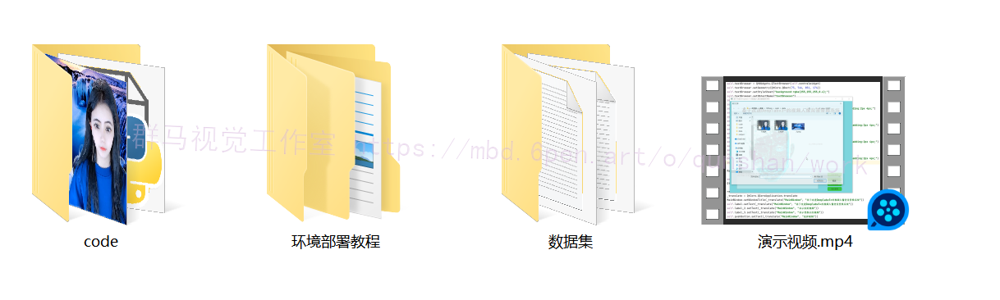

# 1.研究背景
视频背景替换技术是指从视频序列中提取前景信息并将其融合到新背景中的过程，在图像处理和视频编辑领域占有重要地位，具有较高的研究价值和较广的应用空间。视频背景替换技术的核心算法分为视频抠图和图像融合两个部分，然而早期方法存在严重的限制和缺陷，其主要表现为：早期抠图算法限制背景和约束特定拍摄环境进行交互式绿幕抠图，极大限制了拍摄背景、增加了制作成本、锐减了抠图速度；早期图像融合算法对于前景信息丢失严重且缺少数据化评价标准，直接导致融合图像失真，人物颜色虚假。因此，如何减少视频抠图成本、改善视频抠图质量、提高图像融合效果是本课题的主要研究方向。
本文通过对现有图像分割和图像融合技术进行研究改进，提出并实现了改进Deeplabv3+算法和改进PoissonEditing算法，分别用于解决现有的视频抠图和图像融合问题，并联合视频风格迁移算法在终端设计实现了视频人物背景替换系统。

# 2.图片演示

# 3.视频演示
[基于改进Deeplabv3+的视频人像背景替换系统（源码＆教程）_哔哩哔哩_bilibili](https://www.bilibili.com/video/BV1Pg411i7Xm/?vd_source=bc9aec86d164b67a7004b996143742dc)

# 4.算法流程图

# 5.Deeplabv3+简介
在 Deeplabv2 提出可以调整感受视野和特征响应的工具空洞卷积后，为了解决多尺度的图像分割问题，谷歌提出了 Deeplabv3 网络[3]。该网络主要设计了空洞卷积并行架构操作，相比较之前的其他分割网络效果显著，并且在 voc2012 获得极佳的效果，为了解决图像分割网络存在的连续池化与下采样操作带来的像素点定位困难和多尺度目标等问题，Deeplabv3 提出了空洞卷积在网络层的有效运用和对 ASPP 模块的改进等。
a) 深层次的空洞卷积

b) 改进 ASPP

如上图Deeplabv3 重新改进了 Deeplabv2 中提出的 ASPP 空间金字塔池，其中在特征图的顶端采用了四个具有不同动态速率的平行空洞卷积。ASPP 空间金字塔池对不同尺度的特征进行重新采样以准确有效地对任意尺度的区域进行分类是有效的。与 Deeplabv2 不同，Deeplabv3 在 ASPP 中包括批量标准化。不同采样率的 ASPP 设计有效的捕捉了更多的采样信息和多核尺度特征，然而采样率和滤波器权重是反比关系，更多的采样率不可避免的导致了权重数量下降。如图所示，当处于极端情况时，若应用 3x3 卷积映射 65x65 特征将会导致捕捉特征失效，同时 3x3 卷积实际生效的只有中心滤波权重从而退化为 1x1卷积工作。

# 6.算法改进
[参考该博客提出的改进方法](https://mbd.pub/o/bread/Y5yVmpdp)，首先由编码器与解码器并联，通过将 Deeplabv3 作为编码器，由 DCNN 生成多维度特征，遵从 ASPP 规则从而增加感受视野，并通过对输出特征反卷积操作。然后解码器与 Canny 边缘检测串联，利用边缘校正通道算法对深度学习模型分割的人体图像进行后处理。

#### Deeplab3+输出前景图
[参考该博客提出的改进 Deeplabv3+算法原理](https://afdian.net/item?plan_id=03318790671211edac0a52540025c377)，编码层前端采用空洞卷积获取浅层低级特征，传输到解码器前端；编码层后端采用 vgg-16[7]获取深层高级特征信息，并且将 output_stride 为 16 的特征矩阵传输到解码器。解码器接收到高级特征信息，经过双线性上采样得到 output_stride 为 4 的256 通道特征 A；同时为了占比重相同，本文采用 1x1 卷积降通道，将浅层分辨率特征通道降低到 256，从而增强模型学习能力。随后解码器将特征 A 与特征 B做网络层连接(concat)，再经过一个 3x3 的特征卷积细化。最后，在解码器后端经过再双线性 4 倍采样得到深度学习分割预测结果。为了方便后端 Canny 算法产生精准边缘，本文将接收到原图与深度学习分
割经过标签映射得到前景图，前景图计算由公式得到：

#### 边缘校正通道后处理
本节使用遮罩演示当前分割模型存。如下图，在前景图边缘处错误的保留了部分背景，由二值图边缘和前景图边缘融合得到的边缘图可以有效计算出人物分割边缘线蓝色）、前景分割边缘线（红色）和错误背景区域（绿色遮罩）。如何有效的去除遮罩区域将成为提高人体前景分割重叠率的关键。

为了有效去除人体分割中包含的错误背景，本文提出沿边缘线采用边缘矫正通道处理的方法，假设以像素点分布如图，计算图中人物分割边缘线（蓝色）与前景分割边缘线（红色）所围成的错误背景区域，计算公式如下：

在错误背景区域内边缘矫正通道的数值将被置零，其分布如图 :

#### 其他改进点
##### ...

# 7.系统整合
下图[完整源码＆环境部署视频教程＆数据集＆自定义UI界面](https://s.xiaocichang.com/s/7ccbd4)

参考博客[《基于改进Deeplabv3+的视频人像背景替换系统（源码＆教程）》](https://mbd.pub/o/qunma/work)

# 8.参考文献
***
[1][陈淑環](https://s.wanfangdata.com.cn/paper?q=%E4%BD%9C%E8%80%85:%22%E9%99%88%E6%B7%91%E7%92%B0%22),[韦玉科](https://s.wanfangdata.com.cn/paper?q=%E4%BD%9C%E8%80%85:%22%E9%9F%A6%E7%8E%89%E7%A7%91%22),[徐乐](https://s.wanfangdata.com.cn/paper?q=%E4%BD%9C%E8%80%85:%22%E5%BE%90%E4%B9%90%22),等.[基于深度学习的图像风格迁移研究综述](https://d.wanfangdata.com.cn/periodical/jsjyyyj201908002)[J].[计算机应用研究](https://sns.wanfangdata.com.cn/perio/jsjyyyj).2019,(8).DOI:[10.19734/j.issn.1001-3695.2018.05.0270](http://dx.chinadoi.cn/10.19734/j.issn.1001-3695.2018.05.0270).

[2][李郑冬](https://s.wanfangdata.com.cn/paper?q=%E4%BD%9C%E8%80%85:%22%E6%9D%8E%E9%83%91%E5%86%AC%22).[数字图像处理技术发展探究](https://d.wanfangdata.com.cn/periodical/xxjlcl201902066)[J].[信息记录材料](https://sns.wanfangdata.com.cn/perio/xxjlcl).2019,(2).

[3][胡越](https://s.wanfangdata.com.cn/paper?q=%E4%BD%9C%E8%80%85:%22%E8%83%A1%E8%B6%8A%22),[罗东阳](https://s.wanfangdata.com.cn/paper?q=%E4%BD%9C%E8%80%85:%22%E7%BD%97%E4%B8%9C%E9%98%B3%22),[花奎](https://s.wanfangdata.com.cn/paper?q=%E4%BD%9C%E8%80%85:%22%E8%8A%B1%E5%A5%8E%22),等.[关于深度学习的综述与讨论](https://d.wanfangdata.com.cn/periodical/xdkjyc201901001)[J].[智能系统学报](https://sns.wanfangdata.com.cn/perio/xdkjyc).2019,(1).DOI:[10.11992/tis.201808019](http://dx.chinadoi.cn/10.11992/tis.201808019).

[4][安文波](https://s.wanfangdata.com.cn/paper?q=%E4%BD%9C%E8%80%85:%22%E5%AE%89%E6%96%87%E6%B3%A2%22).[基于标准割（Normalized cut）算法图像分割方法](https://d.wanfangdata.com.cn/periodical/sdhg201815044)[J].[山东化工](https://sns.wanfangdata.com.cn/perio/sdhg).2018,(15).

[5][杨红亚](https://s.wanfangdata.com.cn/paper?q=%E4%BD%9C%E8%80%85:%22%E6%9D%A8%E7%BA%A2%E4%BA%9A%22),[赵景秀](https://s.wanfangdata.com.cn/paper?q=%E4%BD%9C%E8%80%85:%22%E8%B5%B5%E6%99%AF%E7%A7%80%22),[徐冠华](https://s.wanfangdata.com.cn/paper?q=%E4%BD%9C%E8%80%85:%22%E5%BE%90%E5%86%A0%E5%8D%8E%22),等.[彩色图像分割方法综述](https://d.wanfangdata.com.cn/periodical/rjdk201804001)[J].[软件导刊](https://sns.wanfangdata.com.cn/perio/rjdk).2018,(4).DOI:[10.11907/rjdk.172535](http://dx.chinadoi.cn/10.11907/rjdk.172535).

[6][肖朝霞](https://s.wanfangdata.com.cn/paper?q=%E4%BD%9C%E8%80%85:%22%E8%82%96%E6%9C%9D%E9%9C%9E%22),[陈胜](https://s.wanfangdata.com.cn/paper?q=%E4%BD%9C%E8%80%85:%22%E9%99%88%E8%83%9C%22).[图像语义分割问题研究综述](https://d.wanfangdata.com.cn/periodical/rjdk201808002)[J].[软件导刊](https://sns.wanfangdata.com.cn/perio/rjdk).2018,(8).DOI:[10.11907/rjdk.173172](http://dx.chinadoi.cn/10.11907/rjdk.173172).

[7][刘克平](https://s.wanfangdata.com.cn/paper?q=%E4%BD%9C%E8%80%85:%22%E5%88%98%E5%85%8B%E5%B9%B3%22),[李西卫](https://s.wanfangdata.com.cn/paper?q=%E4%BD%9C%E8%80%85:%22%E6%9D%8E%E8%A5%BF%E5%8D%AB%22),[隋吉雷](https://s.wanfangdata.com.cn/paper?q=%E4%BD%9C%E8%80%85:%22%E9%9A%8B%E5%90%89%E9%9B%B7%22),等.[基于改进Canny算法的工件边缘检测方法](https://d.wanfangdata.com.cn/periodical/gxdxxb201706006)[J].[广西大学学报（自然科学版）](https://sns.wanfangdata.com.cn/perio/gxdxxb).2017,(6).DOI:[10.13624/j.cnki.issn.1001-7445.2017.2022](http://dx.chinadoi.cn/10.13624/j.cnki.issn.1001-7445.2017.2022).

[8][姚桂林](https://s.wanfangdata.com.cn/paper?q=%E4%BD%9C%E8%80%85:%22%E5%A7%9A%E6%A1%82%E6%9E%97%22),[姚鸿勋](https://s.wanfangdata.com.cn/paper?q=%E4%BD%9C%E8%80%85:%22%E5%A7%9A%E9%B8%BF%E5%8B%8B%22).[基于仿射方法的图像抠图算法综述](https://d.wanfangdata.com.cn/periodical/jsjfzsjytxxxb201604019)[J].[计算机辅助设计与图形学学报](https://sns.wanfangdata.com.cn/perio/jsjfzsjytxxxb).2016,(4).DOI:[10.3969/j.issn.1003-9775.2016.04.019](http://dx.chinadoi.cn/10.3969/j.issn.1003-9775.2016.04.019).

[9][李彦冬](https://s.wanfangdata.com.cn/paper?q=%E4%BD%9C%E8%80%85:%22%E6%9D%8E%E5%BD%A6%E5%86%AC%22),[郝宗波](https://s.wanfangdata.com.cn/paper?q=%E4%BD%9C%E8%80%85:%22%E9%83%9D%E5%AE%97%E6%B3%A2%22),[雷航](https://s.wanfangdata.com.cn/paper?q=%E4%BD%9C%E8%80%85:%22%E9%9B%B7%E8%88%AA%22).[卷积神经网络研究综述](https://d.wanfangdata.com.cn/periodical/jsjyy201609028)[J].[计算机应用](https://sns.wanfangdata.com.cn/perio/jsjyy).2016,(9).DOI:[10.11772/j.issn.1001-9081.2016.09.2508](http://dx.chinadoi.cn/10.11772/j.issn.1001-9081.2016.09.2508).

[10][李彦](https://s.wanfangdata.com.cn/paper?q=%E4%BD%9C%E8%80%85:%22%E6%9D%8E%E5%BD%A6%22).[Contourlet变换在图像去噪及融合算法中的应用研究](https://d.wanfangdata.com.cn/periodical/xajyxyxb201602010)[J].[西安文理学院学报（自然科学版）](https://sns.wanfangdata.com.cn/perio/xajyxyxb).2016,(2).DOI:[10.3969/j.issn.1008-5564.2016.02.010](http://dx.chinadoi.cn/10.3969/j.issn.1008-5564.2016.02.010).

---
#### 如果您需要更详细的【源码和环境部署教程】，除了通过【系统整合】小节的链接获取之外，还可以通过邮箱以下途径获取:
#### 1.请先在GitHub上为该项目点赞（Star），编辑一封邮件，附上点赞的截图、项目的中文描述概述（About）以及您的用途需求，发送到我们的邮箱
#### sharecode@yeah.net
#### 2.我们收到邮件后会定期根据邮件的接收顺序将【完整源码和环境部署教程】发送到您的邮箱。
#### 【免责声明】本文来源于用户投稿，如果侵犯任何第三方的合法权益，可通过邮箱联系删除。